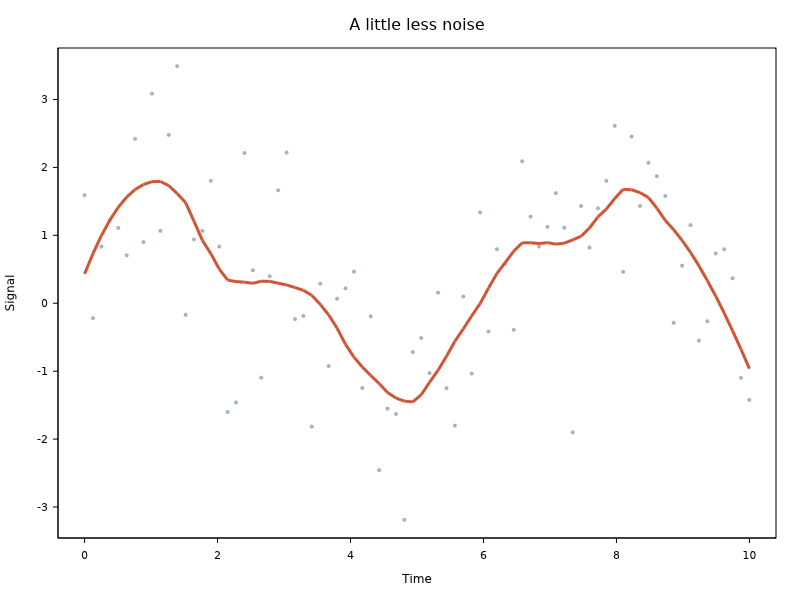
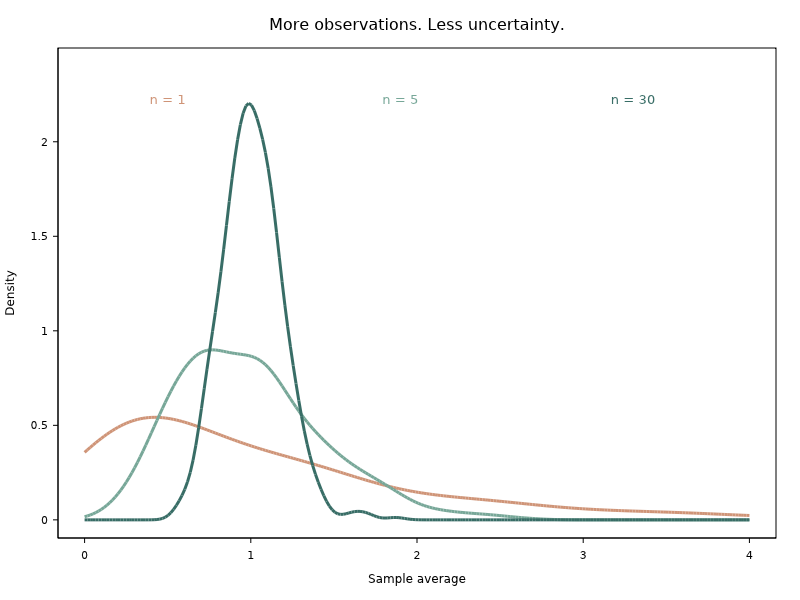
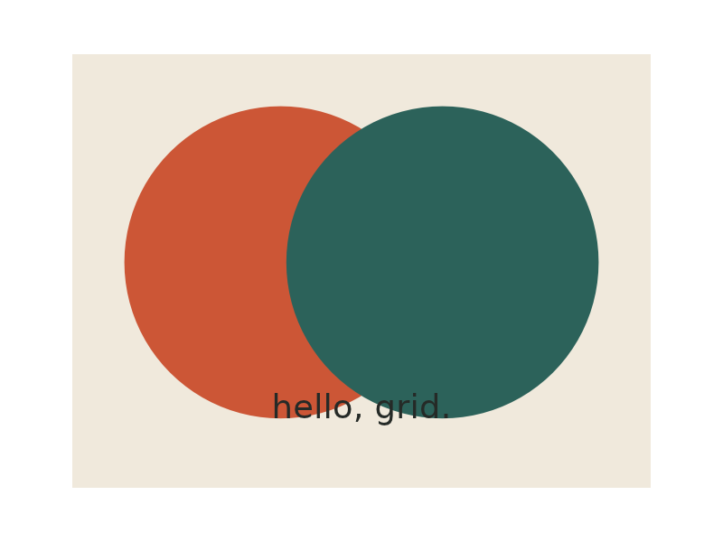

<div align="center">

# Rove

### R belongs everywhere.

**The joy of R. The portability of Rust.**

Explore data, make beautiful plots, and give local AI a statistical tool—
in a browser, a desktop application, or a mobile app.

[Run the website](website/README.md) · [Embed R](crates/r-embed) · [Compatibility](docs/conformance.md) · [Contribute](#build-something-with-us)

<picture>
  <source media="(prefers-color-scheme: dark)" srcset="website/public/examples/loess-dark.png">
  
</picture>

*80 observations. One good hunch. Real R code, running on a Rust runtime.*

</div>

Rove is the showcase and embedding experience for **R-rust**, an experimental Rust port of GNU R. It implements the interpreter and numerical routines in Rust, rather than wrapping an installed R process. The default linear algebra backend uses **faer**; portable graphics use **Vello**.

The ambition is a faithful, pleasant R runtime you can bring into your own software. It is already useful for the supported examples and embedding contracts. **It is not yet a drop-in replacement for GNU R.**

## A little code. A lot of possibility.

```r
set.seed(42)
x <- seq(0, 10, length.out = 80)
y <- sin(x) + rnorm(80, sd = 0.22)
fit <- loess(y ~ x, span = 0.3)

plot(x, y, pch = 16, col = "#a8b6ae",
     xlab = "Time", ylab = "Signal", main = "A little less noise")
lines(x, predict(fit), col = "#cc5636", lwd = 3)
```

The website has **18 editable examples**: statistics, simulations, correlation matrices, probability formulas, and everyday data work. Run them automatically as you edit, or switch to manual execution. Open the standalone editor when you want a quieter workspace.

<table>
<tr>
<td width="50%"><br><strong>Watch averages settle.</strong> See the central limit theorem emerge from simulation.</td>
<td width="50%"><br><strong>Find your rhythm.</strong> Build a calendar from small moments.</td>
</tr>
</table>

## Take R with you

| Where | What you can build | Start here |
| --- | --- | --- |
| **Browser** | A WebAssembly editor, local analysis and PNG plots, running in a worker | [Website setup](website/README.md) |
| **Rust** | An embedded interpreter with owned values and session-scoped handles | [r-embed](crates/r-embed) |
| **Mobile** | Kotlin and Swift integrations through UniFFI bindings | [r-uniffi](crates/r-uniffi) |
| **Local AI** | A model drafts R; the runtime computes and plots the answer | [Runnable AI demo](website/README.md) |
| **Graphics** | Portable CPU rendering and optional GPU canvas/window presentation APIs | [Vello GPU](crates/r-device-vello-gpu/README.md) |
| **Numerics** | Distribution and special-function routines without the interpreter | [Standalone nmath](crates/nmath) |

The AI demo supports a WebGPU browser model and an optional Ollama endpoint. You review the generated code before opening it in the playground. Model weights download only when requested; they are separate from the R runtime.

## Try it locally

For the website, install the prerequisites listed in the [setup guide](website/README.md), then:

```bash
git clone https://github.com/bernaferrari/R-rust.git
cd R-rust/website
pnpm install --frozen-lockfile
pnpm build:runtime
pnpm dev
```

Open the printed local URL. `/editor/` opens just the editor; `/examples/` opens the gallery.

For a native interactive R session, from the repository root:

```bash
cargo run -p r-host-cli
```

Rust is pinned in `rust-toolchain.toml`; dependencies are locked. The default numerical backend is pure Rust/faer. A desktop-only Fortran BLAS/LAPACK profile is also available through the mutually exclusive `fortran-backend` feature; see [backend features](crates/r-embed/Cargo.toml).

## What works—and what is still growing

The implemented surface includes the parser and evaluator, functions and dispatch, vectors and data frames, supported base/statistics operations, seeded random numbers, LOESS, and portable plots. Grid and plotmath share the portable rendering engine.

The important limits are concrete:

- **Packages:** arbitrary CRAN packages, native extensions and serialized package data are not generally supported in the browser.
- **Language fidelity:** compiler/bytecode behavior, namespaces, locales and parts of the GNU R API remain incomplete.
- **Graphics:** advanced grid semantics and exact GNU R font typography still need work. The website uses Vello CPU; GPU presentation is a separate integration surface.
- **Safety:** owned host APIs keep raw interpreter objects private, but unsafe internals still need wider auditing. The runtime is experimental and is not a security boundary for untrusted programs.
- **Resource limits:** the browser has a worker timeout and a combined 1 MiB console capture limit. The browser also enforces a 64 MiB R arena budget, bounded result export, and a 256 MiB Wasm linear-memory ceiling. Browser overhead and AI model weights are separate; native hosts must configure their own limits.

See the [compatibility evidence](docs/conformance.md) and [graphics contracts](docs/loess-and-portable-graphics.md) for the exact scope. Android, browser and desktop support each have different host constraints; bindings alone do not establish a finished mobile integration.

## Evidence over percentages

At the latest verified checkpoint, **636 curated GNU R comparison cases** and **2,783 workspace tests** passed. Browser tests also exercise actual Wasm execution, memory limits, theme accessibility, and auto/manual behavior. These are bounded checks, not an implementation percentage or a claim that every R program works.

The compatibility oracle is pinned to GNU R source commit [`bac583951b`](oracle/r-oracle.json). Tests compare against that exact revision; the [test contract](docs/conformance.md) explains provenance, upstream tests, Miri and GC stress coverage.

```bash
cargo test --workspace
cargo clippy --workspace --all-targets -- -D warnings

# Install the exact GNU R oracle, then use its printed bin directory:
./scripts/install_r_oracle.sh
PATH="/path/to/R/bin:$PATH" ./scripts/conformance_parity.sh --strict
```

## Build something with us

The most useful contributions close a real contract: a small R program, its GNU R result, and a focused implementation or regression test. Good next areas include package loading, grid units and viewport trees, typography, memory budgets, and embedding-boundary fuzzing.

| Inside the repository | Purpose |
| --- | --- |
| [`crates/rmath`](crates/rmath) | Parser, evaluator, object model, GC and translated library operations |
| [`crates/r-embed`](crates/r-embed) | Owned host API and session handles |
| [`crates/r-wasm`](crates/r-wasm) | Browser runtime boundary |
| [`crates/r-graphics-engine`](crates/r-graphics-engine) | Portable graphics and mathematical layout |
| [`website`](website) | React showcase, editor, examples and local AI |
| [`apps/workbench`](apps/workbench) | Full Android and Kotlin/Wasm workbench |
| [`examples/android-compose`](examples/android-compose) | Minimal Android embedding example: sessions, plots and cancellation |
| [`tests`](tests) | Differential, conformance and upstream test evidence |
| [`docs`](docs/README.md) | Maintained contracts, verification and release guides |

Root configuration files are used by Cargo, formatting, CI and agent tooling.
`.cargo` must stay here for Cargo discovery. `LICENSE`, `COPYING` and `NOTICE.md`
preserve license discovery and upstream attribution. Generated artifacts belong
under `target/`; `r-source/` is an ignored local upstream reference checkout.

Read the [architecture](docs/rust-r-port-architecture.md), [upstream port map](docs/upstream-port-map.tsv), and [contribution instructions](AGENTS.md) before changing runtime invariants. Work is tracked with `bd`.

## License & origins

**GPL-2.0-or-later**, matching upstream R. See [LICENSE](LICENSE), [COPYING](COPYING), and [license provenance](docs/license-provenance.md).

This project builds on the work of the R Core Team, the R Foundation, and R's contributors. The GNU R source reference is reproducible from a pinned revision; it is used to guide and verify the port. Rust changes do not erase that provenance.
