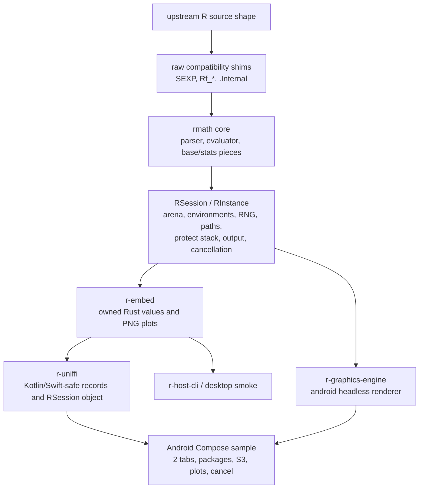

# Rport

Rport is a Rust-first port of core R runtime pieces with an Android embedding
target. The goal is not a C FFI wrapper around GNU R. The goal is a faithful,
session-owned Rust runtime that can eventually power an RStudio-like Android
app while keeping enough source-shape discipline that upstream R behavior can be
reapplied and compared.

Current release proof: **561/561 stock C R conformance cases pass** in the local
parity suite, plus **15/15 curated upstream GNU R core slices**, with focused unit
coverage for packages, S3 registration, multi-session isolation, UniFFI, and
Android plot rendering.

## Architecture



## Crate Map

| Path | Purpose |
| --- | --- |
| `rmath-rs/rmath` | Core translated/runtime implementation: parser, evaluator, SEXP arena, base/stats/math slices, Android-safe session API. |
| `crates/r-embed` | Public Rust embedding wrapper. Returns owned `RValue`, output strings, runtime info, package metadata, and PNG plot bytes. |
| `crates/r-uniffi` | UniFFI binding surface for Android and other hosts. No raw `SEXP` crosses this boundary. |
| `crates/r-graphics-engine` | Small device-independent plotting primitives. |
| `crates/r-device-android-headless` | PNG renderer used by Android plot previews. |
| `crates/r-host-cli` | Host smoke executable for interactive desktop checks. |

## Safety Model

- Mutable interpreter state is owned by `RSession`/`RInstance`: arena, global
  environment, RNG, protect/preserve stacks, output capture, path policy,
  graphics state, and cancellation.
- `Sexp<'a>` is an owner-scoped handle over internal pointers. New Rust-facing
  APIs should prefer `Sexp<'_>` or owned values over raw pointers.
- Android and UniFFI APIs return owned records: `RValue`, `EvalResult`,
  `PackageInfo`, `RuntimeInfo`, `Vec<u8>`/`ByteArray` PNGs.
- Multiple R sessions can run in parallel by giving each tab/worker its own
  `RSession`. Sharing one live session across worker threads is outside the
  current contract.
- Mutable process globals are audited by `scripts/check_android_globals.sh` and
  documented in `docs/android-platform-globals.md`.

## What Works Today

- Parser/evaluator basics: arithmetic, control flow, functions, lazy/default
  args, missing args, vectors/lists, subsetting, attributes, and S3 dispatch
  slices.
- Base/stat/math slices covered by the conformance dashboard, including
  summaries, set operations, output capture, conditions, platform helpers,
  distributions, tail/log flags, and `sample` behavior.
- Pure-R packages from configured Android library paths, including DESCRIPTION
  metadata, NAMESPACE exports/imports, `exportPattern`, and S3 methods.
- Android embedding paths for `.libPaths()`, `find.package()`, `library()`,
  `require()`, `tempdir()`, and `tempfile()`.
- Headless Android plot rendering for simple numeric `plot(...)` calls with
  points/lines/both, labels, colors, `lwd`, and `cex`.
- Cooperative cancellation of long-running evals.

## Known Limits

- This is not a full R implementation yet. The parity suite is strong in the
  covered surface but is not a whole-CRAN compatibility claim.
- Native package loading through `useDynLib()` and direct native entrypoints
  (`.Call`, `.C`, `.Fortran`, `.External`, `dyn.load`, and `library.dynam`) is
  intentionally rejected until an Android host-owned native-library policy
  exists. Pure-R packages remain the supported Android package scope.
- Graphics are useful for demos but not yet a full R graphics device.
- Exact byte-for-byte `.Random.seed` stream parity is not claimed; RNG state is
  session-owned and behavior fixtures assert shape/type/error contracts.
- Some core code remains C-shaped internally to preserve upstream reviewability.
  New public Rust and Android APIs should stay Rust-shaped and owned.

## Android Demo

The Compose sample is in `samples/android-compose`. It demonstrates two
independent R sessions/tabs, eval output, typed result kind, PNG plots, package
listing/loading, S3 dispatch from a bundled pure-R package, and cancellation.

```bash
scripts/generate_uniffi_bindings.sh --out-dir samples/android-compose/app/generated
cargo ndk -t arm64-v8a -o samples/android-compose/app/src/main/jniLibs build -p r-uniffi --release
rstudio-mobile/gradlew -p samples/android-compose :app:assembleDebug
```

For host-side reproducible artifacts without an emulator:

```bash
scripts/android_showcase_artifacts.sh --check
```

That writes:

- `target/android-showcase/showcase-transcript.txt`
- `target/android-showcase/line-plot.png`
- `target/android-showcase/point-plot.png`

## Release Proof

Run the local release gate before claiming a shippable slice:

```bash
scripts/release_gate.sh
```

For Android Gradle packaging too:

```bash
scripts/release_gate.sh --android-package
```

For the slowest local pass, including desktop smoke and generated UniFFI
bindings:

```bash
scripts/release_gate.sh --full
```

The gate covers formatting, strict clippy, Rust tests, Android aarch64 checks,
mutable-global scanning, stock C R conformance parity, generated conformance
artifacts, the public safe API audit, optional Android packaging, and whitespace
validation.

Focused adversarial checks for parser/eval/namespace/memory-facing owned values:

```bash
scripts/adversarial_safety_checks.sh --check
scripts/adversarial_safety_checks.sh --long
```

Performance and memory snapshots:

```bash
scripts/performance_report.sh --quick --check
```

Local release bundle:

```bash
scripts/package_release_artifacts.sh --check
```

Conformance reports are written to:

- `target/release-gate/conformance/summary.json`
- `target/release-gate/conformance/summary.md`

See `docs/conformance.md`, `docs/release-gate.md`,
`docs/release-packaging.md`, `docs/adversarial-testing.md`, `docs/performance.md`,
`docs/upstream-port-map.md`, and `docs/rust-r-port-architecture.md` for the
detailed policy.

## Upstream Porting Discipline

1. Find or add the target row in `docs/upstream-port-map.tsv`.
2. Compare the target upstream C/R behavior under `r-source`.
3. Keep raw compatibility modules close to R when that improves future diffs.
4. Move mutable state, allocation, paths, output, RNG, and cancellation into
   `RSession`/`RInstance`.
5. Add a Rust-shaped typed entrypoint first, then make C-shaped shims delegate.
6. Add stock-R conformance fixtures for user-visible semantics when possible.
7. Run the release gate before committing.

## Roadmap

- Expand conformance fixtures for packages/S3 and graphics beyond unit smoke.
- Add parser/eval fuzzing and property tests.
- Build benchmark and memory-profile baselines for arena/session changes.
- Keep shrinking raw public surface and moving remaining mutable state behind
  explicit sessions.
- Package a repeatable Android release artifact with generated bindings and
  native libraries.
